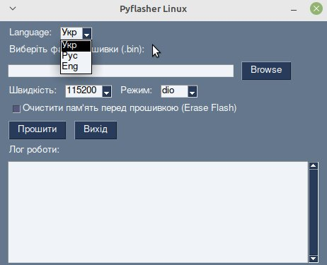

# Pyflasher

Утиліта під Linux для прошивки мікроконтролерів Esp8266.

## 🛠 Проєкт
Це інструмент побудований на утиліті esptool, який допомагає швидко прошивати ваші пристрої на базі Esp8266 прямо з Linux.

## 📸 Скріншот роботи

## 🛠 Встановлення залежностей для роботи інструменту
1. Встановіть графічну бібліотеку
pip3 install PySimpleGUI
2. Встановіть утиліту для прошивки
pip3 install esptool
3. Налаштуйте права доступу до USB (це важливо для Linux):
sudo usermod -a -G dialout $USER

## 📋 Як використовувати
1. Запустіть програму.
2. Оберіть файл прошивки `.bin`.
3. Натисніть кнопку "Прошити".

## 💡 Порада
Якщо виникають помилки з доступом до порту, перевірте права доступу користувача (наприклад, чи додані ви до групи `dialout`).
